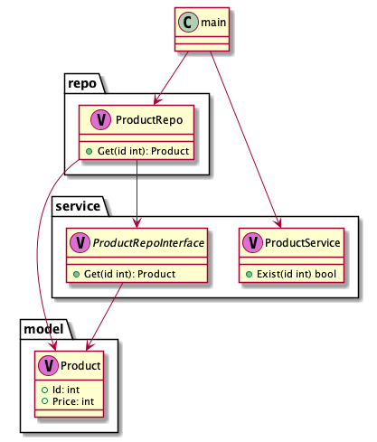

# di sample
## Run Mysql
`docker-compose up -d --build`
## Build and Run app
`go build . && ./di-sample`
## Test
`go test ./... -count=1`

# アーキテクチャ

# 問題
- mysql serverがあってかつ、適切にデータを置かないとserviceのテストできない。
- docker-compose せずにserviceのtestを通そう！
